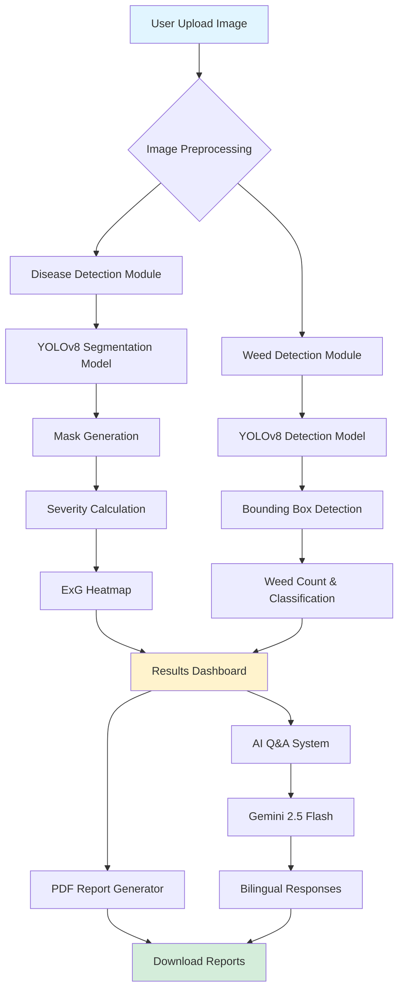

# 🌾 FarmSpectra - AI-Powered Crop Disease & Weed Detection System

<div align="center">


**Advanced Agricultural Intelligence Platform for Wheat Crop Management**

[](https://www.python.org/downloads/)
[](https://streamlit.io/)
[](https://github.com/ultralytics/ultralytics)

[Features](#-key-features) • [Installation](#-installation) • [Usage](#-usage) • [Model Training](#-model-training) • [Demo](#-demo) • [Contributing](#-contributing)

</div>

---

## 📋 Table of Contents

- [Overview](#-overview)
- [Key Features](#-key-features)
- [System Architecture](#-system-architecture)
- [Project Structure](#-project-structure)
- [Installation](#-installation)
- [Usage](#-usage)
- [Model Training](#-model-training)
- [API Integration](#-api-integration)
- [Screenshots](#-screenshots)
- [Technologies Used](#-technologies-used)
- [Performance Metrics](#-performance-metrics)
- [Roadmap](#-roadmap)
- [Contributing](#-contributing)
- [License](#-license)
- [Acknowledgments](#-acknowledgments)

---

## 🌟 Overview

**FarmSpectra** is a comprehensive AI-powered platform designed to revolutionize wheat crop management through intelligent disease and weed detection. Built with cutting-edge deep learning models and an intuitive interface, FarmSpectra empowers farmers with actionable insights to protect their crops and maximize yields.

### 🎯 Problem Statement

Wheat rust disease and weed infestation cause significant crop losses globally, reducing yields by up to 50%. Traditional manual inspection is:
- ⏰ Time-consuming and labor-intensive
- 👁️ Prone to human error and delayed detection
- 📊 Lacks quantitative severity assessment
- 🌍 Limited by agricultural expertise availability

### 💡 Our Solution

FarmSpectra provides:
- 🤖 **Real-time AI Detection** - Instant disease and weed identification from field images
- 📊 **Quantitative Analysis** - Precise severity metrics and affected area calculation
- 🌡️ **Multi-Modal Insights** - ExG heatmaps for vegetation stress visualization
- 💬 **Bilingual Support** - English and Hindi Q&A powered by Gemini AI
- 📄 **Professional Reports** - Downloadable PDF reports with treatment recommendations

---

## ✨ Key Features

### 🔬 Disease Detection Module

<table>
<tr>
<td width="50%">

#### Core Capabilities
- ✅ **Wheat Rust Detection** using YOLOv8 segmentation
- 📊 **Severity Assessment** (Healthy → Severe stress)
- 🗺️ **ExG Heatmap Generation** for vegetation analysis
- 🎨 **Visual Overlay** with infected area highlighting
- 📈 **Health Metrics Dashboard**
  - Healthy area percentage
  - Areas needing attention
  - Serious stress zones
  - Detected disease spots

</td>
<td width="50%">

#### Advanced Features
- 🤖 **AI-Powered Q&A** (Gemini 2.5 Flash integration)
- 🌐 **Bilingual Interface** (English + Hindi)
- 📄 **PDF Report Generation** with treatment plans
- ⚡ **High-Resolution Processing** (up to 1600px)
- 🎯 **Confidence Scoring** for predictions
- 💾 **Downloadable Results**
  - Detection images
  - ExG heatmaps
  - Comprehensive PDF reports

</td>
</tr>
</table>

### 🌿 Weed Detection Module

<table>
<tr>
<td width="50%">

#### Detection Features
- 🎯 **YOLO-based Real-time Detection**
- 📦 **Bounding Box Visualization**
- 🔢 **Weed Count & Confidence Scores**
- 📊 **Severity Classification**
  - None (0 weeds)
  - Low (1-3 weeds)
  - Moderate (4-7 weeds)
  - Severe (8+ weeds)

</td>
<td width="50%">

#### Farmer Advisory
- 🧑‍🌾 **Smart Recommendations** based on severity
- ⏰ **Actionable Timelines** for intervention
- 💊 **Treatment Suggestions**
  - Manual weeding (Low)
  - Selective herbicides (Moderate)
  - Urgent intervention (Severe)
- 📞 **Expert Consultation Guidance**

</td>
</tr>
</table>

---

## 🏗️ System Architecture



### 🔄 Processing Pipeline

1. **Image Upload** → User uploads wheat field RGB image
2. **Preprocessing** → Resize, normalize, and prepare for inference
3. **Model Inference** → YOLOv8 processes image for detection/segmentation
4. **Post-Processing** → Calculate metrics, generate visualizations
5. **Result Generation** → Display dashboard with actionable insights
6. **Report Creation** → Generate downloadable PDF with recommendations

---

## 📁 Project Structure

```
FarmSpectra/
│
├── 📂 data/
│   ├── 📂 processed/
│   │   └── 📂 NWRD_YOLO/          # YOLO-formatted dataset
│   │       ├── 📂 train/
│   │       │   ├── images/
│   │       │   └── labels/
│   │       ├── 📂 val/
│   │       │   ├── images/
│   │       │   └── labels/
│   │       └── data.yaml           # Dataset configuration
│   │
│   └── 📂 raw/
│       └── 📂 NWRD_Raw/            # Original NWRD dataset
│           ├── train/
│           └── test/
│
├── 📂 models/
│   ├── 📂 pretrained/
│   │   └── yolov8m-seg.pt          # Pre-trained YOLOv8 model
│   │
│   └── 📂 trained/
│       ├── best.pt                 # Best disease detection model
│       └── weed_detector_best.pt   # Best weed detection model
│
├── 📂 results/
│   ├── 📂 exg/                     # ExG analysis outputs
│   └── 📂 exg_heatmaps/            # Generated heatmaps
│
├── 📂 src/
│   ├── 📂 data_preparation/
│   │   └── prepare_dataset.py      # Dataset preprocessing script
│   │
│   ├── 📂 training/
│   │   └── train_model.py          # Model training script
│   │
│   ├── 📂 inference/
│   │   └── rust_detector.py        # Disease detection inference
│   │
│   └── 📂 streamlit/
│       ├── app.py                  # Disease detection app
│       ├── Wheat_Weed_app.py       # Weed detection app
│       └── main.py                 # Main navigation app
│
├── 📂 notebooks/                   # Jupyter notebooks for experiments
│
├── 📄 requirements.txt             # Python dependencies
├── 📄 .env                         # Environment variables (API keys)
├── 📄 .gitignore                   # Git ignore file
└── 📄 README.md                    # Project documentation
```

---

## 🚀 Installation

### Prerequisites

- **Python** 3.8 or higher
- **CUDA** (optional, for GPU acceleration)
- **pip** package manager
- **Git** for version control

### Step-by-Step Setup

#### 1️⃣ Clone the Repository

```bash
git clone https://github.com/yourusername/FarmSpectra.git
cd FarmSpectra
```

#### 2️⃣ Create Virtual Environment

```bash
# Windows
python -m venv venv
venv\Scripts\activate

# Linux/Mac
python3 -m venv venv
source venv/bin/activate
```

#### 3️⃣ Install Dependencies

```bash
pip install --upgrade pip
pip install -r requirements.txt
```

#### 4️⃣ Download Pre-trained Models

```bash
# Create models directory
mkdir -p models/pretrained models/trained

# Download YOLOv8 segmentation model
wget https://github.com/ultralytics/assets/releases/download/v0.0.0/yolov8m-seg.pt -P models/pretrained/
```

#### 5️⃣ Configure Environment Variables

Create a `.env` file in the root directory:

```env
GEMINI_API_KEY=your_gemini_api_key_here
```

> 🔑 Get your Gemini API key from [Google AI Studio](https://makersuite.google.com/app/apikey)

#### 6️⃣ Verify Installation

```bash
python -c "import streamlit; import torch; import cv2; print('✅ All dependencies installed!')"
```

---

## 📖 Usage

### 🎯 Running the Application

#### Option 1: Main Navigation App (Recommended)

```bash
streamlit run src/streamlit/main.py
```

This launches the main FarmSpectra interface with navigation between Disease and Weed Detection modules.

#### Option 2: Individual Modules

**Disease Detection Only:**
```bash
streamlit run src/streamlit/app.py
```

**Weed Detection Only:**
```bash
streamlit run src/streamlit/Wheat_Weed_app.py
```

### 🖼️ Using the Disease Detection Module

1. **Upload Image**
   - Click "📤 Upload RGB Image"
   - Select a wheat field image (JPG, PNG, JPEG)
   - Maximum file size: 200MB

2. **View Analysis**
   - Original vs. AI-detected overlay
   - Health metrics dashboard
   - Severity assessment
   - ExG heatmap visualization

3. **Get Recommendations**
   - Review treatment suggestions
   - Check confidence scores
   - Read detailed explanations

4. **Ask Questions**
   - Use pre-defined Q&A (English + Hindi)
   - Ask custom questions via AI chat
   - Get context-aware responses

5. **Download Reports**
   - PDF comprehensive report
   - Detection image with overlays
   - ExG heatmap analysis

### 🌿 Using the Weed Detection Module

1. **Upload Field Image**
   - Select wheat field image
   - Click "🔍 Run Weed Detection"

2. **Review Results**
   - View bounding boxes on weeds
   - Check weed count and confidence
   - Assess severity classification

3. **Follow Advisory**
   - Read farmer recommendations
   - Note action timelines
   - Download detection report

---

## 🎓 Model Training

### 📊 Dataset Preparation

The project uses the **NWRD (National Wheat Rust Detection)** dataset with custom preprocessing for optimal YOLO training.

#### Preprocessing Pipeline

```python
# Key improvements for high accuracy:
# 1. Lower area threshold (10px) to capture small rust spots
# 2. Minimal polygon smoothing (0.002) for accurate shapes
# 3. High-resolution training (1024px)
```

**Run Dataset Preparation:**

```bash
python src/data_preparation/prepare_dataset.py
```

**This script:**
- ✅ Extracts NWRD dataset
- ✅ Converts masks to YOLO segmentation format
- ✅ Splits data (90% train, 10% validation)
- ✅ Generates `data.yaml` configuration

### 🏋️ Training the Model

#### Disease Detection Model

```bash
python src/training/train_model.py
```

**Training Configuration:**

| Parameter | Value | Purpose |
|-----------|-------|---------|
| Model | `yolov8m-seg.pt` | Medium model for accuracy |
| Image Size | 1024px | High resolution for small spots |
| Epochs | 50 | Sufficient convergence |
| Batch Size | 8 | Memory-efficient |
| Confidence | 0.15 | High sensitivity threshold |

**Training Output:**
```
models/trained/best.pt          # Best model checkpoint
models/trained/last.pt          # Last epoch checkpoint
runs/segment/train/             # Training logs and metrics
```

#### Weed Detection Model

For weed detection, use YOLO object detection (not segmentation):

```python
from ultralytics import YOLO

model = YOLO('yolov8m.pt')  # Detection model
results = model.train(
    data='weed_dataset/data.yaml',
    epochs=100,
    imgsz=640,
    batch=16,
    name='weed_detector'
)
```

### 📈 Monitoring Training

**TensorBoard Visualization:**

```bash
tensorboard --logdir runs/segment/train
```

**Key Metrics to Monitor:**
- 📊 mAP@0.5 (mean Average Precision)
- 📉 Loss curves (box, mask, classification)
- 🎯 Precision-Recall curves
- 🔍 Validation predictions

---

## 🔌 API Integration

### Gemini AI Integration

FarmSpectra uses **Google Gemini 2.5 Flash** for intelligent Q&A responses.

#### Setup

1. Install Gemini SDK:
```bash
pip install google-generativeai
```

2. Configure API key in `.env`:
```env
GEMINI_API_KEY=your_key_here
```

3. Usage in code:
```python
from google import genai

client = genai.Client(api_key=os.getenv("GEMINI_API_KEY"))

response = client.models.generate_content(
    model="gemini-2.5-flash",
    contents=prompt
)
```

#### Features

- 🌐 **Bilingual Responses** (English + Hindi)
- 🔍 **Context-Aware** (uses current detection results)
- ⚡ **Fast Response Times** (< 2 seconds)
- 🎯 **Agriculture-Specific** knowledge base

---

## 📸 Screenshots

### 🏠 Home Dashboard


<div align="center">

*Main navigation interface with module selection*

</div>

### 🔬 Disease Detection Interface

<div align="center">

*Disease detection results with severity metrics and visualizations*

</div>

### 🌿 Weed Detection Interface

<div align="center">

*Real-time weed detection with bounding boxes and severity classification*

</div>

### 📊 Health Metrics Dashboard

<div align="center">

*Detailed health analysis with percentage breakdowns*

</div>

### 📄 PDF Report Sample

<div align="center">

*Professional downloadable report with recommendations*

</div>

---

## 🛠️ Technologies Used

### 🤖 Machine Learning & AI

| Technology | Version | Purpose |
|------------|---------|---------|
|  | Latest | Object detection & segmentation |
|  | 2.0+ | Deep learning framework |
|  | 4.8+ | Image processing |
|  | 2.5 | AI-powered Q&A |
|  | Latest | Numerical computing |

### 🖥️ Web Framework & UI

| Technology | Version | Purpose |
|------------|---------|---------|
|  | 1.28+ | Web interface |
|  | 3.7+ | Data visualization |
|  | 10.0+ | Image handling |

### 📄 Document Generation

| Technology | Version | Purpose |
|------------|---------|---------|
|  | 4.0+ | PDF report creation |

### 🔧 Development Tools

- **Git** - Version control
- **Python** 3.8+ - Primary language
- **Jupyter** - Experimentation notebooks
- **VS Code** - IDE

---

## 🤝 Contributing

We welcome contributions from the community! Here's how you can help:

### 🐛 Reporting Bugs

1. Check existing issues first
2. Create detailed bug report with:
   - Steps to reproduce
   - Expected vs actual behavior
   - Screenshots (if applicable)
   - System information

### 💡 Suggesting Features

1. Open an issue with `[Feature Request]` tag
2. Describe the feature and use case
3. Explain why it benefits farmers

### 🔧 Pull Requests

```bash
# 1. Fork the repository
# 2. Create feature branch
git checkout -b feature/amazing-feature

# 3. Make changes and commit
git commit -m "Add amazing feature"

# 4. Push to branch
git push origin feature/amazing-feature

# 5. Open Pull Request
```

**PR Guidelines:**
- ✅ Follow PEP 8 style guide
- ✅ Add tests for new features
- ✅ Update documentation
- ✅ Keep commits atomic and descriptive

---

## 🙏 Acknowledgments

### 🛠️ Open Source Projects

- [Ultralytics YOLOv8](https://github.com/ultralytics/ultralytics) - Object detection framework
- [Streamlit](https://streamlit.io/) - Web app framework
- [Google Gemini](https://ai.google.dev/) - AI language model


---

### 🐛 Issue Tracker

Found a bug? Have a suggestion?  
[Open an issue on GitHub](https://github.com/yourusername/farmspectra/issues)

---

<div align="center">

### 🌾 Empowering Farmers with AI 🤖

**Made with ❤️ by the FarmSpectra Team**

[⬆ Back to Top](#-farmspectra---ai-powered-crop-disease--weed-detection-system)

</div>

---

**🌟 Star this repository if you find it helpful!**
